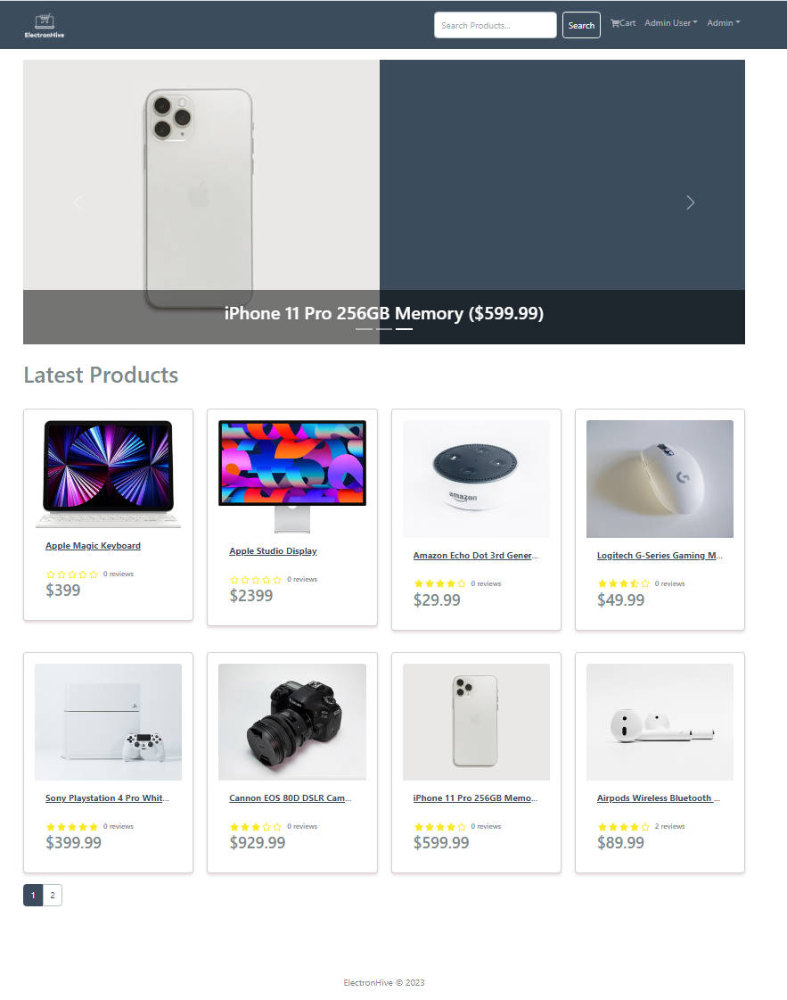

# ElectronHive eCommerce Platform



> eCommerce platform built with the MERN stack & Redux Toolkit.
> This project has a full-featured shopping cart with PayPal & credit/debit payments.
> Advanced features: Email-verification with OTP, Real-time chat, Charts used to compare with different dates' sale.

### Env Variables

Rename the `example.env` file to `.env` and add the following

```
NODE_ENV = development
PORT = 5000
MONGO_URI = your mongodb uri
JWT_SECRET = 'abc123'
PAYPAL_CLIENT_ID = your paypal client id
PAGINATION_LIMIT = 8
```

Change the JWT_SECRET and PAGINATION_LIMIT to what you want

```
Sample User Logins

admin@email.com (Admin)
123456

john@email.com (Customer)
123456

jane@email.com (Customer)
123456
```
